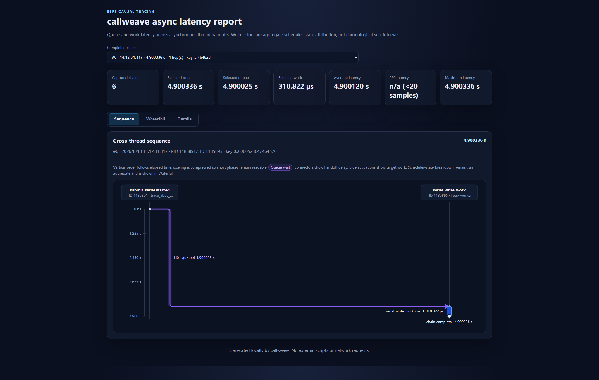
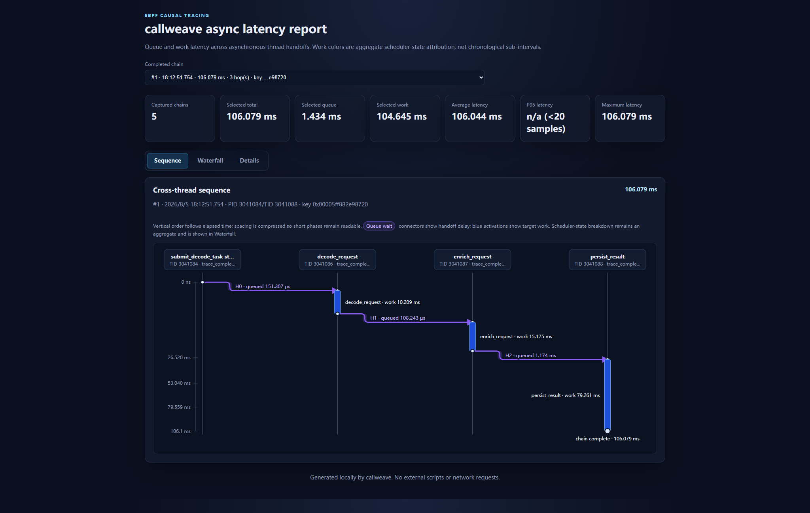
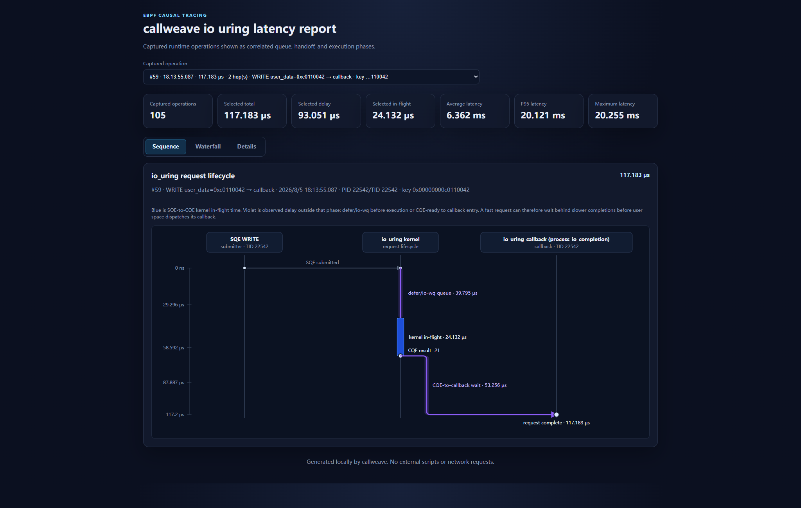
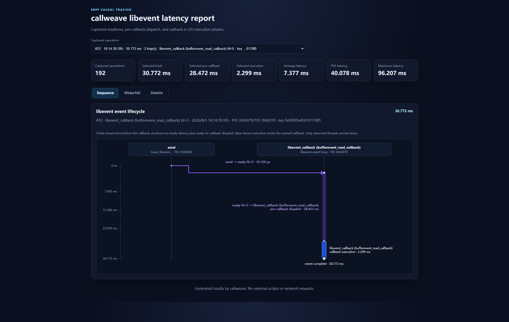

<!-- SPDX-License-Identifier: MIT -->

# callweave-ebpf

[](https://github.com/dimsoul/callweave-ebpf/actions/workflows/ci.yml)
[](LICENSE)

**Find where asynchronous latency went across native Linux threads without
adding application instrumentation.**

`callweave` uses eBPF and uprobes to connect selected user-space functions,
thread handoffs, scheduler delays, epoll readiness, io_uring completions, and
runtime callbacks into evidence-backed causal paths.

## A five-second delay, localized

A deterministic reconstruction of a
[reported node-serialport problem](https://github.com/serialport/node-serialport/issues/797)
appears only when network requests are slow. Callweave separates the missing
time from the serial work itself:

| Observed symptom | Callweave evidence | Localized cause |
| --- | --- | --- |
| Serial operations stall for about five seconds during slow network requests | Selected operation: `4.900025 s` queued, `310.822 us` executing | Four blocking DNS jobs occupy libuv's four shared workers |



_Purple is time spent waiting before `serial_write_work` starts. The short
blue activation is the serial work itself._

After installing the [build requirements](#requirements), reproduce the
diagnosis and generate a self-contained HTML report:

```sh
make demo-libuv-threadpool
```

Read the
[complete case study](docs/cases/libuv-dns-threadpool-contention.md), including
the four-worker trace and the eight-worker causal control.

## Install v1.1.2

Prebuilt release archives are available for Ubuntu 24.04 on amd64 and arm64.
Install the runtime libraries, download the archive for the current machine,
and verify it before extracting:

```sh
sudo apt install libbpf1 libelf1t64 zlib1g libzstd1 binutils

version=v1.1.2
case "$(uname -m)" in
  x86_64) arch=amd64 ;;
  aarch64|arm64) arch=arm64 ;;
  *) echo "unsupported architecture: $(uname -m)" >&2; exit 1 ;;
esac

base_url="https://github.com/dimsoul/callweave-ebpf/releases/download/$version"
archive="callweave-$version-linux-$arch.tar.gz"
curl --fail --location --remote-name "$base_url/$archive"
curl --fail --location --remote-name "$base_url/SHA256SUMS"
grep " $archive$" SHA256SUMS | sha256sum --check
tar --extract --gzip --file "$archive"
cd "callweave-$version-linux-$arch"
sudo ./callweave --help
```

Callweave needs Linux 5.8 or newer, kernel BTF at
`/sys/kernel/btf/vmlinux`, and root or equivalent BPF/perf capabilities. The
archive includes the executable, examples, documentation, and licenses. For
other Linux distributions, use the [source build](#requirements).

## What it answers

Callweave is designed to answer questions such as:

- Who submitted this work?
- How long did it wait before another thread started it?
- Was the target executing, blocked, or waiting for CPU?
- Which epoll-ready FD or io_uring request led to the slow work?
- Did a libuv or libevent callback actually run, or is only a weaker fallback correlation available?
- Which futex blocked a slow event-loop callback, and which thread woke it?

## Real problem cases

The bundled [libuv delayed-callback case study](docs/cases/libuv-work-callback-delay.md)
reproduces a reported `uv_queue_work()` symptom where `work_cb` has already
returned but `after_work_cb` arrives about 50 ms later. Callweave uses the same
`uv_work_t *` to separate worker-pool queueing, worker execution, and the
post-worker event-loop delay. The reproduction makes the cause visible: a
long-running callback is blocking the event-loop thread, rather than libuv
adding a fixed 50 ms delay.

The [libevent blocking-listener case study](docs/cases/libevent-blocking-accept.md)
reconstructs a report where periodic timers stop after the first client
connects. Automatic callback discovery shows that epoll readiness and libevent
dispatch are prompt, while the listener callback spends about 1.5 seconds
blocked in `accept()`, preventing the event loop from servicing its timers.

The [libuv shared-thread-pool case study](docs/cases/libuv-dns-threadpool-contention.md)
reconstructs a node-serialport report where slow network requests delay
unrelated serial operations by seconds. Callweave shows that the serial work
spends about five seconds queued but only microseconds executing, while four
blocking DNS jobs occupy every worker in libuv's default shared pool.

Callweave complements sampling profilers and distributed tracing. A profiler shows where CPU samples accumulate, while Callweave focuses on selected asynchronous operations and explains where their elapsed time went.

## What it can trace

| Area | Main result | Documentation |
| --- | --- | --- |
| Native functions | Entry stack, return value, duration, scheduler-state attribution, and futex waker | [Function tracing](docs/features/function-tracing.md) |
| Cross-thread work | Up to eight handoffs with queue and work latency for every hop | [Async call chains](docs/features/async-call-chain.md) |
| Thread pools | Pending and active work, worker observations, tail latency, and deterministic bottleneck hints | [Queue diagnostics](docs/features/queue-diagnostics.md) |
| epoll | Wait batches, ready-to-I/O dispatch, FD lifetime, wake sources, callback timing, callback futex/waker attribution, ET/ONESHOT diagnostics, and waiter fairness | [epoll diagnostics](docs/features/epoll.md) |
| io_uring | SQE-to-CQE latency, io-wq behavior, ring pressure, errors, linked requests, resources, and optional user callback correlation | [io_uring diagnostics](docs/features/io-uring.md) |
| libuv | Automatic native `uv_poll_t` handle, FD, and callback discovery over the epoll tracer | [libuv adapter](docs/runtimes/libuv.md) |
| libevent | Automatic raw-event, socket-bufferevent, existing-FD listener, FD, and application-callback discovery through stable public APIs | [libevent adapter](docs/runtimes/libevent.md) |

## Causal model

For an asynchronous thread-pool path, Callweave reconstructs:

```text
producer stack
    -> source function
    -> queue wait
    -> target thread starts
    -> target work: on-CPU / blocked / run queue / preempted
    -> next handoff or final return
```

For an event-loop path, it connects:

```text
wake source
    -> monitored FD becomes ready
    -> epoll returns
    -> ready-to-I/O dispatch
    -> runtime callback entry and return
```

Every resolvable epoll path is classified by its strongest observed evidence:

- `exact`: readiness plus a completed matched callback;
- `ready-to-I/O`: callback boundary unavailable, but matching FD I/O observed;
- `ready-only`: readiness observed without a matching callback completion or I/O.

See [evidence levels](docs/reference/evidence-levels.md) for the exact semantics.

## Requirements

- Linux 5.8 or newer as a practical baseline.
- Kernel BTF at `/sys/kernel/btf/vmlinux`.
- `clang`, `llvm`, `bpftool`, `make`, and `addr2line`.
- Development packages for libbpf, libelf, and zlib.
- Root or sufficient BPF/perf capabilities.

On Debian or Ubuntu:

```sh
sudo apt install make clang llvm bpftool binutils libbpf-dev libelf-dev zlib1g-dev
```

Runtime adapters do not link Callweave against libuv or libevent. Only their optional test programs need development packages:

```sh
sudo apt install libuv1-dev libevent-dev
```

See [getting started](docs/getting-started.md) for build artifacts and source layout.

## Build

```sh
make
```

The build generates `src/vmlinux.h`, the BPF object, the libbpf skeleton, the `callweave` executable, and bundled test programs.

## Quick start

Trace a function in an existing process:

```sh
sudo ./callweave -p PID function_to_trace
```

Measure its return value, duration, and scheduler-state attribution:

```sh
sudo ./callweave -p PID --ret --attribution function_to_trace
```

Trace a two-hop asynchronous chain:

```sh
sudo ./callweave -p PID \
  --async-hop submit_compute_task,2,process_request,1 \
  --async-hop submit_storage_task,2,write_result,1 \
  write_result
```

Load the same trace from a configuration file:

```sh
sudo ./callweave -p PID --config examples/thread-pool.yaml
```

Launch an asynchronous target only after every configured probe is ready:

```sh
sudo ./callweave \
  --config examples/libuv-threadpool-contention.yaml \
  --exec ./test/trace_libuv_threadpool_contention -- \
  --startup-delay-ms 0
```

Diagnose io_uring requests:

```sh
sudo ./callweave -p PID --io-uring
```

Diagnose an epoll event loop:

```sh
sudo ./callweave -p PID --epoll
```

Automatically adapt native libuv poll callbacks:

```sh
sudo ./callweave -p PID --libuv
```

Automatically adapt libevent I/O callbacks:

```sh
sudo ./callweave -p PID --libevent
```

To avoid missing initialization or the first asynchronous submission, let
Callweave launch a configured async, epoll, or runtime target after all probes
are ready:

```sh
sudo ./callweave --libuv --duration 20 \
  --exec ./server -- --port 8080
```

## Output detail modes

epoll, libuv, and libevent default to a final aggregate summary:

```sh
sudo ./callweave -p PID --libuv
```

Stream only slow or anomalous paths:

```sh
sudo ./callweave -p PID --libuv --live
```

Stream every collected detail:

```sh
sudo ./callweave -p PID --libuv --verbose
```

The advanced `--min-epoll-*-us` options remain available for custom BPF-side thresholds. See the [CLI reference](docs/reference/cli-options.md).

## Reports

Completed asynchronous chains can be exported as JSON Lines and as a self-contained HTML report:

```sh
sudo ./callweave -p PID \
  --config examples/thread-pool.yaml \
  --format json \
  --output ./callweave.jsonl \
  --report ./callweave.html
```

Standalone epoll, libuv, libevent, and io_uring modes provide both structured
JSON and the same tabbed HTML report surface. Runtime Sequence views retain
only observed phases, such as SQE→CQE→callback or ready→callback. See
[JSON and HTML output](docs/output/reports.md).

### Multi-hop asynchronous chain



_A three-hop request across four native threads, with queue delay and execution
time preserved on one causal timeline._

### io_uring request lifecycle



_A WRITE request split into defer/io-wq queueing, kernel in-flight time, and
CQE-to-callback delay._

### libevent callback lifecycle



_A socketpair wake connected across the producer and event-loop threads, with
pre-callback dispatch separated from `bufferevent_read_callback` execution._

## Documentation

Start with the [documentation index](docs/README.md).

- [Getting started](docs/getting-started.md)
- [CLI reference](docs/reference/cli-options.md)
- [Function tracing](docs/features/function-tracing.md)
- [Asynchronous call chains](docs/features/async-call-chain.md)
- [Queue and thread-pool diagnostics](docs/features/queue-diagnostics.md)
- [epoll diagnostics](docs/features/epoll.md)
- [io_uring diagnostics](docs/features/io-uring.md)
- [libuv adapter](docs/runtimes/libuv.md)
- [libevent adapter](docs/runtimes/libevent.md)
- [Evidence levels](docs/reference/evidence-levels.md)
- [Testing guide](docs/testing.md)
- [Release guide](docs/releasing.md)
- [Troubleshooting](docs/troubleshooting/common-issues.md)
- [Architecture](docs/architecture.md)

## Why not use GDB?

GDB is the better tool for stopping at one failure, inspecting complex variables, and stepping through control flow. It can also script cross-thread correlation, but breakpoints stop threads and can perturb the scheduling and queueing behavior being investigated.

Callweave is intended for short, targeted observation when stopping the process would change the result. It records events with eBPF instead of pausing on every hit, but uprobes, stack collection, and symbolization still have overhead. Very hot functions should be selected carefully.

## Scope and boundaries

- Correlation keys are raw nonzero integer or pointer values; Callweave does not infer application types.
- Automatic target-argument scanning accepts a match only when exactly one of arguments 1-8 matches.
- Kernel and runtime tracepoint availability varies by version; optional capabilities degrade with warnings.
- Late attachment cannot reconstruct activity that completed before probes were active.
- Runtime adapters only claim `exact` evidence when a complete matching callback entry/return pair was observed.
- This is a targeted diagnostic tool, not an always-on high-cardinality tracing backend.

Run `./callweave --help` for the current complete option list.
